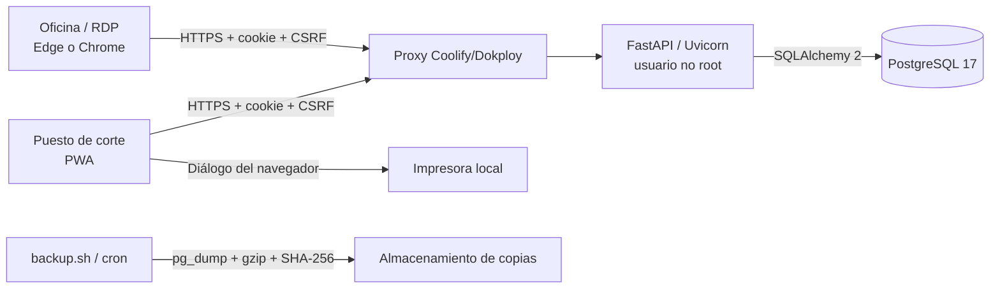

# Arquitectura de Confección Central

## Vista general

La impresora nunca se conecta al VPS. El servidor genera datos y registra la intención confirmada tras el evento de impresión; el navegador del puesto utiliza el driver local.

## Componentes

| Componente | Responsabilidad |
|---|---|
| `app/config.py` | Variables tipadas y garantías de configuración |
| `app/database.py` | Motor, sesiones y base declarativa |
| `app/models.py` | Modelo relacional y restricciones |
| `app/schemas.py` | Contratos Pydantic y validaciones empresariales |
| `app/permissions.py` | Matriz única de permisos y roles |
| `app/security.py` | Hash y verificación de contraseñas |
| `app/history.py` | Diferencias y eventos auditables |
| `app/main.py` | Middleware, API, transacciones y entrega del frontend |
| `app/cli.py` | Bootstrap administrativo explícito |
| `app/static/index.html` | Estructura de la interfaz |
| `app/static/central.js` | Estado de UI, API, Excel, órdenes e impresión |
| `app/static/sw.js` | Instalación PWA y actualización de estáticos |
| `migrations/` | Evolución controlada de PostgreSQL con Alembic |

## Límites de confianza

1. El navegador es no confiable: no decide permisos, snapshots, números ni transiciones.
2. FastAPI valida identidad, CSRF, esquema, permiso y versión antes de escribir.
3. PostgreSQL aplica integridad, unicidad y precisión decimal.
4. El proxy es responsable de TLS y de conservar la IP; `FORWARDED_ALLOW_IPS` debe restringirse a su red.
5. Los backups son datos sensibles y deben cifrarse/controlarse fuera del repositorio.

## Transacciones críticas

- **Guardar trabajo:** bloqueo de fila, comparación de versión, validación del documento completo, sincronización de habitaciones y auditoría en un commit.
- **Crear orden:** bloqueo de trabajo, versión esperada, snapshot del servidor, numeración serializada, ítems congelados, bloqueo del trabajo y auditoría en un commit.
- **Estado de orden:** bloqueo de fila, transición permitida, timestamps y auditoría en un commit.
- **Usuarios:** cambio de contraseña o actividad incrementa `auth_version` y revoca sesiones anteriores.

## Persistencia

El volumen `confeccion_postgres` contiene la base. La imagen de aplicación es inmutable y de solo lectura. El arranque ejecuta `alembic upgrade head`; no crea tablas desde modelos. Los adjuntos futuros deberán usar almacenamiento de objetos: el modelo `documents` no implica guardar binarios en PostgreSQL.

Consulte el modelo detallado en `docs/DIAGRAMA_BD.md` y la máquina de órdenes en `docs/FLUJO_ORDENES.md`.
