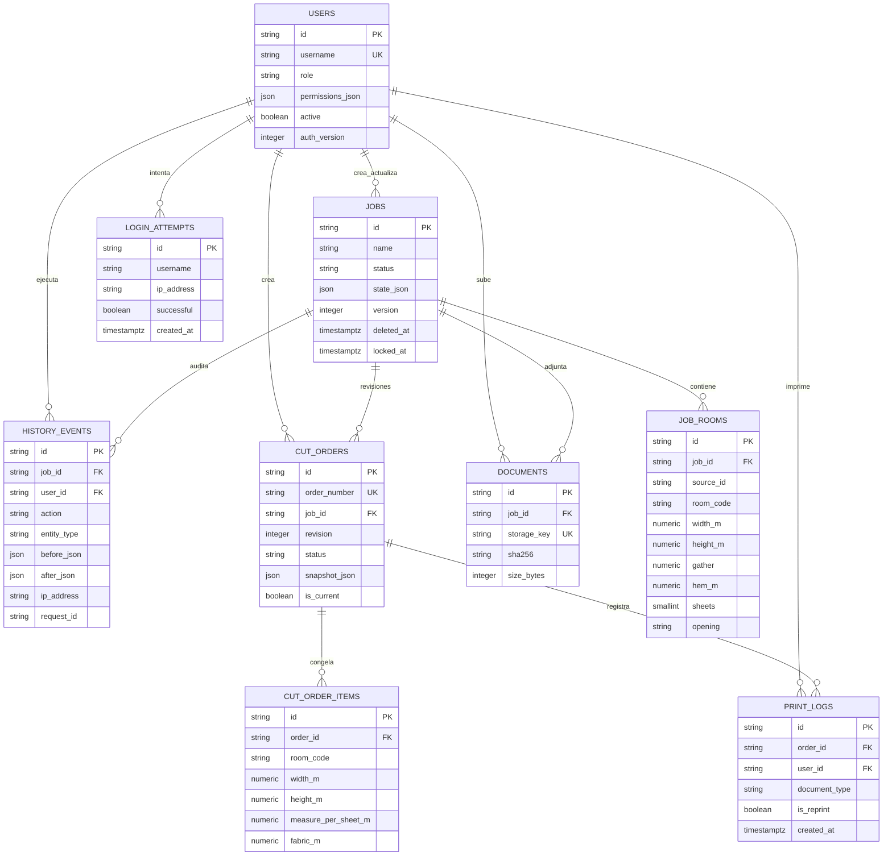

# Diagrama de base de datos

Las FK de órdenes e ítems usan `RESTRICT` para preservar trazabilidad; las habitaciones del trabajo usan `CASCADE`; auditoría/usuarios usan `SET NULL` donde debe conservarse el evento.
