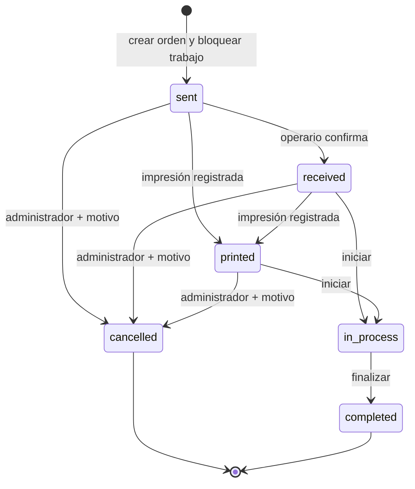

# Flujo de órdenes

## Reglas

- No se puede saltar de `sent` a `completed`.
- No se puede retroceder de `completed`.
- Imprimir crea `print_logs`; la segunda y posteriores son reimpresiones.
- Crear orden congela el estado persistido y las habitaciones en `cut_order_items`.
- El trabajo queda bloqueado; modificarlo por UI o API devuelve 423.
- Reabrir requiere `orders_approve`, motivo y una orden que no esté en proceso/finalizada. La orden deja de ser vigente; la siguiente emisión incrementa revisión.
- Cancelar exige permiso/motivo y conserva toda la trazabilidad.

Los estados de preparación `draft/reviewed/approved` previos al envío están pendientes como flujo explícito; actualmente la emisión autorizada produce directamente `sent`.
